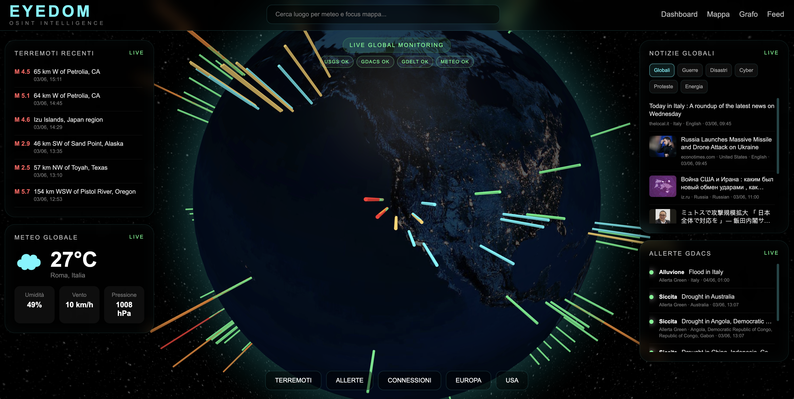

# 🌍 EYEDOM

  
  
  
  

### Real-Time OSINT Intelligence Platform

Monitor earthquakes, disasters, geopolitical events, weather conditions, and global news through an interactive 3D globe.

 

  

  

## 👁️ Overview

EYEDOM is an experimental **Open-Source Intelligence (OSINT)** platform designed to provide real-time global situational awareness.

The platform aggregates multiple public intelligence sources and visualizes them on an interactive 3D Earth, allowing analysts, researchers, journalists, and enthusiasts to explore worldwide events from a single interface.

## ✨ Features

### 🌎 Global Monitoring
- Interactive 3D Globe Visualization
- Real-Time Event Mapping
- Dynamic Geospatial Exploration

### 🌋 Natural Events
- Live Earthquake Monitoring
- Magnitude & Location Tracking
- Global Seismic Awareness

### 🚨 Disaster Intelligence
- GDACS Alert Integration
- Disaster Monitoring
- Humanitarian Event Tracking

### 📰 News Intelligence
- Global News Aggregation
- Topic-Based Filtering
- Geolocated Event Visualization

### 🌤 Weather Monitoring
- Real-Time Weather Data
- Environmental Context
- Location-Based Insights

## 🛰 Data Sources

| Source | Purpose |
|----------|----------|
| USGS | Earthquake Monitoring |
| GDACS | Disaster Alerts |
| GDELT | Global News Intelligence |
| OpenWeather | Weather Monitoring |

## 🚀 Roadmap

### Alpha (Current)

- [x] Interactive 3D Globe
- [x] Earthquake Feed
- [x] Weather Integration
- [x] GDACS Alerts
- [x] Global News Feed
- [x] Layer Filtering
- [x] Real-Time Dashboard

### Version 0.2

- [ ] Event Correlation Engine
- [ ] Geopolitical Risk Layer
- [ ] Historical Timeline
- [ ] Advanced Search

### Version 0.3

- [ ] Knowledge Graph
- [ ] Threat Intelligence Layer
- [ ] Custom Alerts
- [ ] Intelligence Reports

### Version 1.0

- [ ] Multi-Source Intelligence Fusion
- [ ] Predictive Analysis
- [ ] Global Risk Monitoring
- [ ] Advanced OSINT Toolkit

---

## 🛠 Technology Stack

### Frontend

- HTML5
- CSS3
- JavaScript
- Globe.gl

### Data Sources

- USGS API
- GDACS API
- GDELT API
- OpenWeather API

### Visualization

- Interactive 3D Earth
- Real-Time Data Layers
- Geospatial Event Mapping

---

## 🎯 Vision

EYEDOM aims to evolve into a comprehensive intelligence platform capable of:

- Event Correlation
- Crisis Monitoring
- Geopolitical Analysis
- Disaster Awareness
- Threat Intelligence
- Situational Awareness

The objective is simple:

> **Transform global data into actionable intelligence.**

---

## ⚠ Disclaimer

EYEDOM is an experimental project developed for educational, research, and situational awareness purposes.

The information displayed originates from public sources and should not be considered authoritative for emergency response or operational decision-making.

---

## 🤝 Contributing

Contributions, suggestions, and feedback are welcome.

If you're interested in OSINT, geospatial intelligence, data visualization, or global monitoring systems, feel free to open an issue or submit a pull request.

---

## 📜 License

MIT License

---

### 🌍 See the World. Understand the Signal.

**EYEDOM — OSINT Intelligence Platform**

